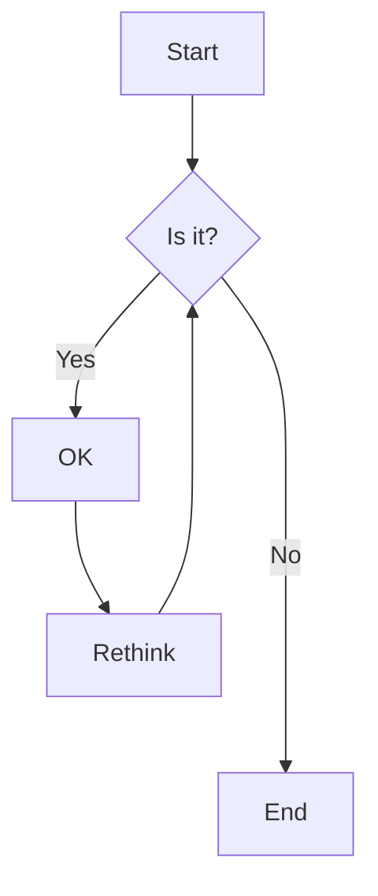

Cover image : By Vincent van Gogh - bgEuwDxel93-Pg — Google Arts &amp; Culture, Public Domain, https://commons.wikimedia.org/w/index.php?curid=25498286


We're no strangers to love

You know the rules and so do I

A full commitment's what I'm thinking of

You wouldn't get this from any other guy

I just wanna tell you how I'm feeling

Gotta make you understand

Never gonna give you up

Never gonna let you down

Never gonna run around and desert you

Never gonna make you cry

Never gonna say goodbye

Never gonna tell a lie and hurt you

We've known each other for so long

Your heart's been aching, but

You're too shy to say it

Inside, we both know what's been going on

We know the game and we're gonna play it

And if you ask me how I'm feeling

Don't tell me you're too blind to see

Never gonna give you up

Never gonna let you down

Never gonna run around and desert you

Never gonna make you cry

Never gonna say goodbye

Never gonna tell a lie and hurt you

Never gonna give you up

Never gonna let you down

Never gonna run around and desert you

Never gonna make you cry

Never gonna say goodbye

Never gonna tell a lie and hurt you

(Ooh, give you up)

(Ooh, give you up)

Never gonna give, never gonna give

(Give you up)

Never gonna give, never gonna give

(Give you up)

We've known each other for so long

Your heart's been aching, but

You're too shy to say it

Inside, we both know what's been going on

We know the game and we're gonna play it

I just wanna tell you how I'm feeling

Gotta make you understand

Never gonna give you up

Never gonna let you down

Never gonna run around and desert you

Never gonna make you cry

Never gonna say goodbye

Never gonna tell a lie and hurt you

Never gonna give you up

Never gonna let you down

Never gonna run around and desert you

Never gonna make you cry

Never gonna say goodbye

Never gonna tell a lie and hurt you

Never gonna give you up

Never gonna let you down

Never gonna run around and desert you

Never gonna make you cry

Never gonna say goodbye

Never gonna tell a lie and hurt you

Writer(s): Pete Waterman, Mike Stock, Matt Aitken

Song: [Never Gonna Give You Up](https://www.youtube.com/watch?v=dQw4w9WgXcQ)

## Test Markdown

This article offers a sample of basic Markdown syntax that can be used in Hugo content files, also it shows whether basic HTML elements are decorated with CSS in a Hugo theme.


## Headings

The following HTML `<h1>`—`<h6>` elements represent six levels of section headings. `<h1>` is the highest section level while `<h6>` is the lowest.

# H1

## H2

### H3

#### H4

##### H5

###### H6

## Paragraph

Xerum, quo qui aut unt expliquam qui dolut labo. Aque venitatiusda cum, voluptionse latur sitiae dolessi aut parist aut dollo enim qui voluptate ma dolestendit peritin re plis aut quas inctum laceat est volestemque commosa as cus endigna tectur, offic to cor sequas etum rerum idem sintibus eiur? Quianimin porecus evelectur, cum que nis nust voloribus ratem aut omnimi, sitatur? Quiatem. Nam, omnis sum am facea corem alique molestrunt et eos evelece arcillit ut aut eos eos nus, sin conecerem erum fuga. Ri oditatquam, ad quibus unda veliamenimin cusam et facea ipsamus es exerum sitate dolores editium rerore eost, temped molorro ratiae volorro te reribus dolorer sperchicium faceata tiustia prat.

Itatur? Quiatae cullecum rem ent aut odis in re eossequodi nonsequ idebis ne sapicia is sinveli squiatum, core et que aut hariosam ex eat.

## Blockquotes

The blockquote element represents content that is quoted from another source, optionally with a citation which must be within a `footer` or `cite` element, and optionally with in-line changes such as annotations and abbreviations.

#### Blockquote without attribution

> Tiam, ad mint andaepu dandae nostion secatur sequo quae.
> **Note** that you can use _Markdown syntax_ within a blockquote.

#### Blockquote with attribution

> Don't communicate by sharing memory, share memory by communicating.
>
> — <cite>Rob Pike[^1]</cite>

[^1]: The above quote is excerpted from Rob Pike's [talk](https://www.youtube.com/watch?v=PAAkCSZUG1c) during Gopherfest, November 18, 2015.

## Tables

Tables aren't part of the core Markdown spec, but Hugo supports them out-of-the-box.

| Name  | Age |
| ----- | --- |
| Bob   | 27  |
| Alice | 23  |

#### Inline Markdown within tables

| Italics   | Bold     | Code   |
| --------- | -------- | ------ |
| _italics_ | **bold** | `code` |

## Code Blocks

#### Inline Code

`This is Inline Code`

#### Only `pre`

<pre>
This is pre text
</pre>

#### Code block with backticks

```
<!DOCTYPE html>
<html lang="en">
    <head>
        <meta charset="utf-8" />
        <title>Example HTML5 Document</title>
    </head>
    <body>
        <p>Test</p>
    </body>
</html>
```

#### Code block with backticks and language specified

```html {linenos=true}
<!DOCTYPE html>
<html lang="en">
    <head>
        <meta charset="utf-8" />
        <title>Example HTML5 Document</title>
        <meta name="description" content="Sample article showcasing basic Markdown syntax and formatting for HTML elements.">
    </head>
    <body>
        <p>Test</p>
    </body>
</html>
```

#### Code block indented with four spaces

    <!doctype html>
    <html lang="en">
    <head>
      <meta charset="utf-8">
      <title>Example HTML5 Document</title>
    </head>
    <body>
      <p>Test</p>
    </body>
    </html>

#### Code block with Hugo's internal highlight shortcode



<!doctype html>
<html lang="en">
<head>
  <meta charset="utf-8">
  <title>Example HTML5 Document</title>
</head>
<body>
  <p>Test</p>
</body>
</html>


#### Gist



## List Types

#### Ordered List

1. First item
2. Second item
3. Third item

#### Unordered List

-   List item
-   Another item
-   And another item

#### Nested list

-   Fruit
    -   Apple
    -   Orange
    -   Banana
-   Dairy
    -   Milk
    -   Cheese

## Other Elements — abbr, sub, sup, kbd, mark

<abbr title="Graphics Interchange Format">GIF</abbr> is a bitmap image format.

H<sub>2</sub>O

X<sup>n</sup> + Y<sup>n</sup> = Z<sup>n</sup>

Press <kbd><kbd>CTRL</kbd>+<kbd>ALT</kbd>+<kbd>Delete</kbd></kbd> to end the session.

Most <mark>salamanders</mark> are nocturnal, and hunt for insects, worms, and other small creatures.

## Test Rich Content




## Test Math

```katex
\underbrace{a}_{b} - \underbrace{c}_{d}
```

Inline formulas: {{< katex formula="{a}^{b} - \overbrace{c}^{d}" inline=true />}}, {{< katex "\sum_{i = 0}^N 2i = y" true />}}.

$$\int_{-\infty}^{\infty} e^{-x^2} dx$$


\begin{array}{l}
E*{o 1}=\frac{1}{2}\left( { target }*{o 1}- { out }_{o 1}\right)^{2}=\frac{1}{2}(0.01-0.75136507)^{2}=0.274811083 \\
E_{o 2}=0.023560026 \\
E*{ {total }}=E*{o 1}+E\_{o 2}=0.274811083+0.023560026=0.298371109
\end{array}



## Test Mermaid



erDiagram CUSTOMER }|..|{ DELIVERY-ADDRESS : has CUSTOMER ||--o{ ORDER : places CUSTOMER ||--o{ INVOICE : "liable for" DELIVERY-ADDRESS ||--o{ ORDER : receives INVOICE ||--|{ ORDER : covers ORDER ||--|{ ORDER-ITEM : includes PRODUCT-CATEGORY ||--|{ PRODUCT : contains PRODUCT ||--o{ ORDER-ITEM : "ordered in" 


## Test emoji
[emoji cheat sheet](https://www.webfx.com/tools/emoji-cheat-sheet/)

🙈 :see_no_evil: 🙉 :hear_no_evil: 🙊 :speak_no_evil:
